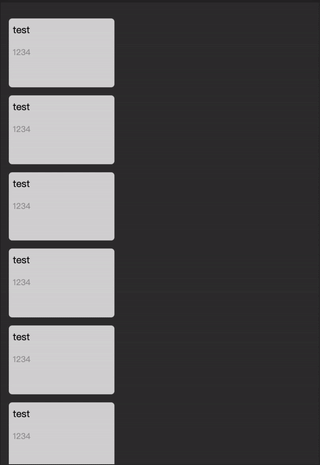

# react-igrid

<!--- These are examples. See https://shields.io for others or to customize this set of shields. You might want to include dependencies, project status and licence info here --->



Mimic the phone app in iphone, create a grid with spring-physics based animation.

For now, it only works on mobile device.

## Installation

```
# npm install react-igrid

or

# yarn add react-igrid
```

## Usage

### Example

```
import React, { useRef } from 'react';
import Grid from 'react-igrid';
import { disableBodyScroll, enableBodyScroll } from 'body-scroll-lock';

export default () => {
  const containerRef = useRef(null);

  return (
    <div ref={containerRef}>
      <Cube
        title="grid"
        excerpt="some excerpt"
        lockContainerScroll={lockContainerScroll}
        unlockContainerScroll={unlockContainerScroll}
      />
        <div>something in the children</div>
        <div>maybe a components</div>
      </Grid>
    </div>
  );
};

```

## API Reference (WIP)

### Props

| name            |       default value        | description          |
| --------------- | :------------------------: | -------------------- |
| `initialWidth`  |     `calc(100vw / 3)`      | initial width        |
| `initialHeight` | `calc(23.33vw - 0.666rem)` | initial height       |
| `initialColor`  | `rgba(255, 255, 255, 0.8)` | initial color        |
| `finalHeight`   |    `calc(100vh - 10%)`     | final height         |
| `finalTop`      |            `0`             | final top position   |
| `finalLeft`     |            `0`             | final left position  |
| `finalRight`    |            `0`             | final right position |
| `finalColor`    |        `lightblue`         | final color          |
| `title`         |           `test`           | title                |
| `excerpt`       |           `1234`           | excerpt              |
| `image`         |                            | image                |
| `children`      |                            | React components     |

### Events

| name                    | default value | description                        |
| ----------------------- | :-----------: | ---------------------------------- |
| `lockContainerScroll`   |  `() => {}`   | lock the parent container scroll   |
| `unlockContainerScroll` |  `() => {}`   | unlock the parent container scroll |

## Contribute

Contributions, issues and feature requests are welcome.

## Credits

Inspired by [Progressive Web Animations | Alexandra Holachek](https://github.com/aholachek/mobile-first-animation) at React Conf 2019.

Here is the [youtube](https://www.youtube.com/watch?v=laPsceJ4tTY)
